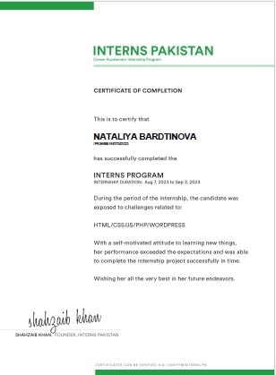
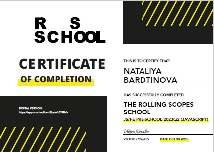

# Bardtinova Nataliya
****
### Junior Frontend Developer

### _Contacts:_
- +380933044911
- bardtinova@gmail.com
- [LinkedIn](@Bardtinova)
- [Facebook](https://www.facebook.com/Bardtinova)
******************************

### _About myself👱‍♀️_

> For a long time I worked as a computer science teacher. I've always been interested in development. I decided to change my career. I am sure that my ability to make decisions and solve problems will help in mastering the > future profession. I am interested in web development because this profession provides endless opportunities for professional growth, in addition, there are a huge amount of quality resources for self-education and a
> large community of developers.
> I believe that my ability to learn and acquire new skills will help me become an experienced Frontend Developer.
********************************

### _Hard skills:_
- Html5
- Css / Sass / Less
- JavaScript
- TypeScript
- React
- WordPress
- php
- Git / GitHub
- Figma
- Photoshop

**********************************

### _Code example:_
```push(this: Stack, value: T) {
    if (this.length() + 1 > this.limit) {
        throw new Error("Stack Overflow");
    }
    this.stack.push(value);
    }
    pop(this: Stack): T {
    if (this.length() !== 0)  {
        return this.stack.pop() as T;
    }
            throw new Error("Stack Underflow");
        }
length(this: Stack): number {
    return this.stack.length;
}
```

******************************
### _Work Experience_
- [Marvel: react project](https://portfolio-marvel-bardtinova.vercel.app/)
- [JavaScript project](https://bardtinova.github.io/portfolio-Food/)
- [JavaScript project](https://bardtinova.github.io/portfolio-Window/)
- [The site is created in OOP style](https://bardtinova.github.io/portfolio-Source/)

*************************** 

### _Education_
- Nikolaev State University
- Udemy courses: Figma, Html, Css, JavaScript, TypeScript, React, WordPress
- 
- 


********************************

### _Languages_
- English - Intermediate
- Russian - Native
- Ukrainian - Native

